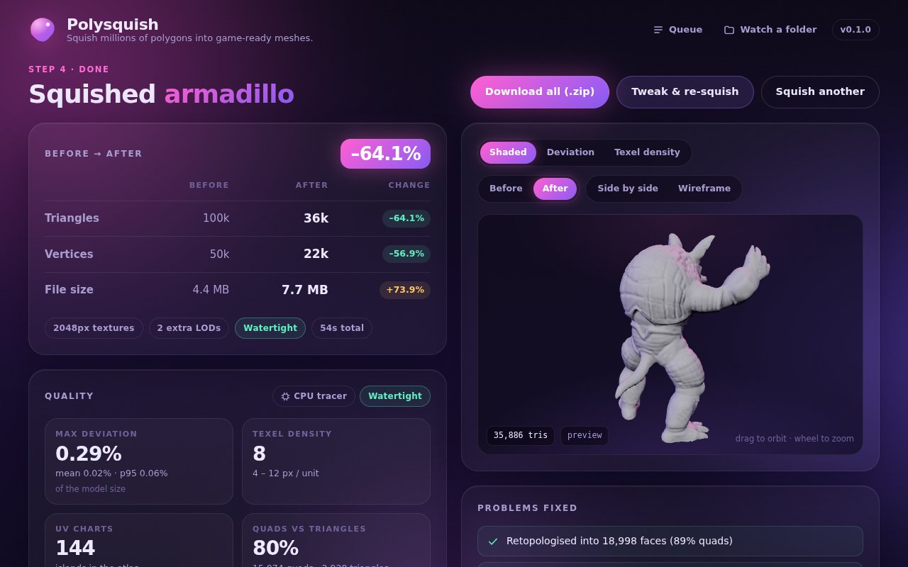

<p align="center">
  
</p>

# Polysquish

**Squish multi-million-polygon AI-generated 3D models into small, clean, game-ready meshes.**
One executable, no installs, no accounts, free for everyone.

Drop in the raw output of Meshy, Tripo, Hunyuan3D, TRELLIS, Rodin, a photogrammetry scan, a point
cloud or a Gaussian splat and get back:

- a cleaned, decimated mesh at the triangle budget you choose, as **triangles**, a **quad-dominant**
  retopology for things that deform, or a watertight **voxel rebuild** for broken inputs
- a fresh UV layout (xatlas, charted on smoothed geometry so decimation noise does not fragment it),
  or UDIM tiles when you keep materials separate
- baked **normal**, **albedo**, **ambient occlusion** and **ORM** textures, ray-traced from the original
  on the CPU or on the GPU (wgpu), with hard-edge aware normals, thin-part safe rays and a denoised AO
- an LOD chain with screen-coverage thresholds, an optional **imposter** atlas as the last LOD, and
  convex-hull / box / simplified **collision** shapes
- the **rig**: skin weights, skeleton and animations are carried over for characters
- **GLB**, **OBJ + MTL + PNG** and native **FBX** (with LOD groups, skin and animation), plus an HTML
  report, quality metrics and deviation / texel-density heat-maps in the viewer

Typical run on a 4-core laptop: a 4,000,000-triangle model becomes a 30,000-triangle asset with 2K
textures, 3 LODs and collision in about 40 seconds, using ~2 GB of RAM.

## Run it

```sh
polysquish            # opens the UI in your browser at http://127.0.0.1:7777
```

Drop a model (or several, for a batch), read the plain-language health check, pick a preset, hit
**Squish it**, download the zip. Set up a **watch folder** to squish everything that lands in a
directory overnight. Everything runs locally; nothing leaves your machine.

A native desktop window (`Polysquish` app, built from `desktop/`) is produced by CI for Windows,
macOS and Linux and wraps the same UI without a browser tab.

### Command line

```sh
polysquish squish model.obj -p hero                 # presets: character, hero, prop, mobile, dcc
polysquish squish model.glb -p prop --target unreal # unity | unreal | godot | blender | maya | c4d
polysquish squish model.ply -t 12000 --texture 4096 --no-ao
polysquish inspect model.stl                        # health report as JSON
polysquish presets --dump hero > my_recipe.json     # edit, then: --recipe my_recipe.json
polysquish bench --quick                            # regression corpus (see corpus/README.md)
```

Inputs: `.obj` (with MTL/textures), `.ply` (ASCII or binary, vertex colours, point clouds, 3D
Gaussian splats), `.splat`, `.stl`, `.glb`, `.gltf` (with skins and animations).

## Presets

| Preset | Triangles | Textures | Topology | Notes |
|---|---:|---:|---|---|
| Character | 40k | 2K | quad-dominant | rig + animations kept, 2 LODs |
| Hero asset | 30k | 2K | triangles | 3 LODs, collision, AO |
| Environment prop | 5k | 1K | triangles | 3 LODs, collision |
| Mobile / VR | 1.5k | 1K | triangles | 2 LODs, no metal/rough map |
| Blender / Maya / C4D | 150k | 4K | quad-dominant | materials kept as UDIM tiles, no LODs |

Every knob is in the Advanced panel or the recipe JSON (`docs/API.md` documents all fields).

## Engine and DCC integrations

`integrations/` holds a Blender add-on, a Unity package, an Unreal Engine 5 editor plugin, and
Maya / Cinema 4D scripts that call the executable and import the result with correct texture and
LOD settings. They are written against the public APIs but have **not been executed inside the
hosts** in this environment; each README carries a manual test checklist.

## Build from source

Requires a Rust toolchain (1.80+) and a C/C++ compiler (for meshoptimizer and xatlas).

```sh
cargo build --release          # -> target/release/polysquish (single executable)
cargo test --release           # 34 integration + unit tests
scripts/fetch_testdata.sh      # optional public test models (incl. rigged Fox / CesiumMan)
cargo run --release -- synth testdata/xyzrgb_dragon.obj -o dragon_4m.ply --levels 2   # 4M-tri stress input
```

The web UI in `ui/` is embedded into the binary at build time. For UI development run
`polysquish ui --ui-dir ui` to serve it from disk, or open `ui/index.html?mock=1` for a backend-free mock.

GitHub Actions builds the CLI for Windows, macOS (Intel and Apple silicon) and Linux on every push
(`build.yml`), the desktop app and installers (`desktop.yml`), and runs the regression bench on a
schedule (`bench.yml`). Pushing a `v*` tag attaches the executables to a GitHub Release.

## How it works

| Stage | What happens |
|---|---|
| Import | Streaming OBJ / PLY / STL / glTF / splat loaders; node hierarchy flattened; textures, skins and animations decoded; point clouds reconstructed into a surface |
| Health check | Components, non-manifold and open edges, degenerate faces, duplicates, UV/colour presence, unit and up-axis guess, plain-language problem list |
| Clean | Tolerance weld, degenerate removal, floater removal, winding repair, **hidden interior face removal** (ray visibility, region-aware), optional voxel rebuild (surface nets) |
| Decimate | meshoptimizer attribute-aware edge collapse, **chunked and parallel** above 1.5M triangles, border locking with safe fallbacks, material boundaries locked when keeping materials |
| Retopo | Isotropic remesh projected onto the source and paired into quads (quad-dominant mode) |
| UV | Reuse source UVs if sane, else xatlas on smoothed geometry; one UDIM tile per material when requested |
| Bake | BVH or wgpu compute ray tracing; two-sided search along smooth normals with per-vertex thickness limits; hard-edge corner normals; MikkTSpace tangents; normal (OpenGL or DirectX), albedo, low-discrepancy AO with edge-aware denoise, ORM; supersampling and dilation |
| LODs | Chained simplification, GPU cache / overdraw / fetch optimisation, MSFT_lod in the GLB, optional octahedral imposter atlas + 3-card billboard |
| Rig | Joint weights transferred by closest point, skeleton and animation clips written to GLB and FBX |
| Collision | Convex hull (parry), bounding box, ~300-triangle simplified mesh; `UCX_` naming for Unreal |
| Metrics | Deviation (mean / p95 / max), texel density, chart and quad counts; heat-map GLBs for the viewer |
| Export | GLB (per-material primitives, skins, animations), OBJ + MTL (PBR fields, material groups), FBX 7.4 binary (LodGroup, skin, animation), per-LOD OBJs, report.html, recipe.json, result.json |

## Status and limitations

This is **V2**. Known limitations, all documented in the code and docs:

- The quad retopology is isotropic, not field-aligned: no guaranteed edge loops around cylinders.
- Voxel rebuild and point-cloud reconstruction are surface-nets based (not Poisson); resolution is
  capped at 512³ / 256³.
- FBX arrays are uncompressed; cubic-spline animation keys are written as linear; FBX carries the
  first material only when materials are kept separate.
- The GPU tracer skips software adapters (llvmpipe, WARP) and self-tests against the CPU before use;
  it was validated end to end only through a software device in this environment.
- Chunked decimation parallelises and bounds the simplifier's working set, but the input mesh is still
  loaded in RAM (plan on ~0.5 GB per million triangles).
- The desktop app and the engine integrations are built and syntax-checked by CI but were not run
  inside Blender, Unity, Unreal, Maya or Cinema 4D here.

See `docs/OPTIMIZATION_LIST.md` for the original 100-item plan and `corpus/README.md` for how to
contribute real AI-generator outputs to the regression corpus.

## Licence

MIT. Third-party components: meshoptimizer (MIT), xatlas (MIT), parry (Apache-2.0), wgpu (MIT/Apache-2.0),
three.js (MIT).
