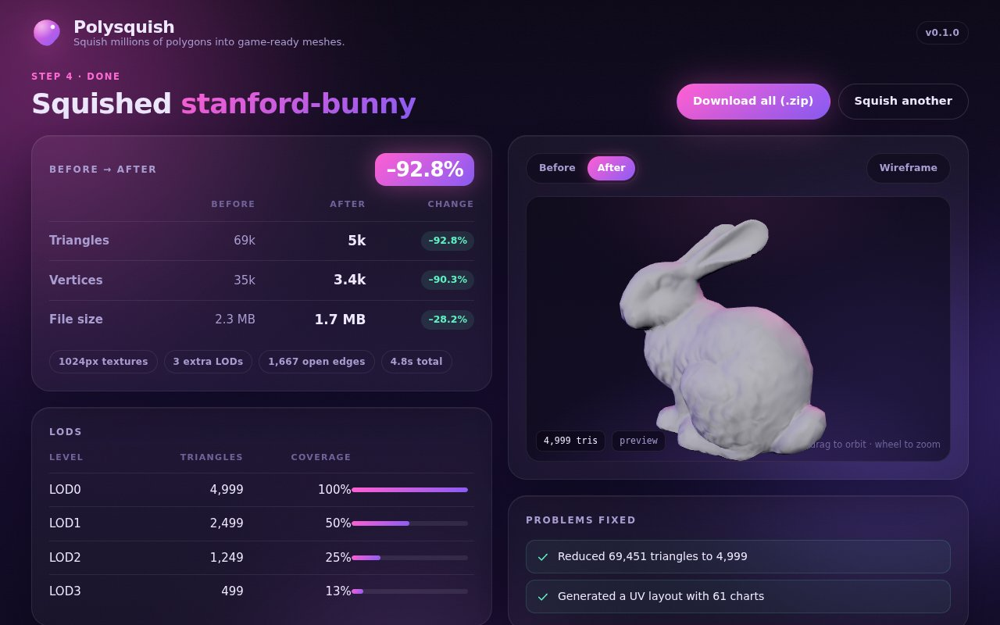

<p align="center">
  
</p>

# Polysquish

**Squish multi-million-polygon AI-generated 3D models into small, clean, game-ready meshes.**
One executable, no installs, no accounts, free for everyone.

Drop in the raw output of Meshy, Tripo, Hunyuan3D, TRELLIS, Rodin, a photogrammetry scan or any
other dense mesh and get back:

- a cleaned, decimated mesh at the triangle budget you choose (30k hero · 5k prop · 1.5k mobile · 150k DCC)
- a fresh UV layout (xatlas) when the source has none or its UVs are broken
- baked **normal**, **albedo**, **ambient occlusion** and **ORM** textures, ray-traced on the CPU from the original
- an LOD chain with screen-coverage thresholds, plus convex-hull / box / simplified **collision** shapes
- **GLB** (for Unity, Unreal, Godot, Blender) and **OBJ + MTL + PNG** (for Maya, Cinema 4D and everything else)
- an HTML report with before/after stats, timings and the exact recipe used

Typical run: a 4,000,000-triangle model becomes a 30,000-triangle asset with 2K textures and 3 LODs in about
45 seconds on a 4-core laptop, using ~2 GB of RAM.

## Run it

```sh
polysquish            # opens the UI in your browser at http://127.0.0.1:7777
```

Drop a model, read the plain-language health check, pick a preset, hit **Squish it**, download the zip.
Everything runs locally; nothing leaves your machine.

### Command line

```sh
polysquish squish model.obj -p hero                 # presets: hero, prop, mobile, dcc
polysquish squish model.glb -p prop --target unreal # unity | unreal | godot | blender | maya | c4d
polysquish squish model.ply -t 12000 --texture 4096 --no-ao
polysquish inspect model.stl                        # health report as JSON
polysquish presets --dump hero > my_recipe.json     # edit, then: --recipe my_recipe.json
```

Inputs: `.obj` (with MTL/textures), `.ply` (ASCII or binary, vertex colours), `.stl`, `.glb`, `.gltf`.

## Build from source

Requires a Rust toolchain (1.80+) and a C/C++ compiler (for meshoptimizer and xatlas).

```sh
cargo build --release          # -> target/release/polysquish (single ~12 MB executable)
cargo test --release
scripts/fetch_testdata.sh      # optional public test models
cargo run --release -- synth testdata/xyzrgb_dragon.obj -o dragon_4m.ply --levels 2   # 4M-tri stress input
```

The web UI in `ui/` is embedded into the binary at build time. For UI development run
`polysquish ui --ui-dir ui` to serve it from disk, or open `ui/index.html?mock=1` for a backend-free mock.

GitHub Actions builds Windows, macOS (Intel and Apple silicon) and Linux executables on every push, and
attaches them to the release when a `v*` tag is pushed.

## How it works

| Stage | What happens |
|---|---|
| Import | Streaming OBJ / PLY / STL / glTF loaders; node hierarchy flattened; textures decoded |
| Health check | Components, non-manifold and open edges, degenerate faces, duplicates, UV/colour presence, unit and up-axis guess, plain-language problem list |
| Clean | Tolerance weld, degenerate removal, floater removal, winding repair by flood fill + volume/normal vote |
| Decimate | meshoptimizer attribute-aware edge collapse (normals, UVs, colours), border locking, sloppy fallback to always hit the budget |
| UV | Reuse source UVs if they are inside 0..1 and overlap-free, otherwise xatlas charting + packing |
| Bake | Binned-SAH BVH over the source; two-sided ray search along smooth normals; MikkTSpace tangents; normal (OpenGL or DirectX), albedo from textures or vertex colours, cosine-weighted AO, ORM; supersampling and edge dilation |
| LODs | Chained simplification from LOD0, GPU cache / overdraw / fetch optimisation, MSFT_lod in the GLB |
| Collision | Convex hull (parry), bounding box, ~300-triangle simplified mesh; `UCX_` naming for Unreal |
| Export | GLB with embedded PNGs, OBJ + MTL (PBR `Pr`/`Pm` fields), per-LOD OBJs, report.html, recipe.json, result.json |

## Status

This is **V1**. It covers the pipeline above end to end and is tested on meshes up to 4M triangles.
Not yet included (see `docs/OPTIMIZATION_LIST.md` for the full 100-item plan):

- **FBX export.** OBJ and GLB import cleanly into Maya, Cinema 4D, Blender, Unity, Unreal and Godot. If you
  need FBX today, import the GLB into Blender and export FBX from there. A native FBX writer is planned for V2.
- Quad-dominant retopology for animated characters (V1 produces clean triangle meshes).
- Out-of-core processing beyond what fits in RAM, GPU baking, imposters, skinning transfer, batch watch-folder.

## Licence

MIT. Third-party components: meshoptimizer (MIT), xatlas (MIT), parry (Apache-2.0), three.js (MIT).
